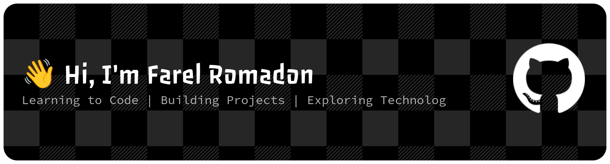

## About Me
I'm an IT student who enjoys learning about programming,
Linux, networking, and web development.

🌱 Currently learning:
- 🌐 Web Development
- 🐍 Python
- 🐧 Linux
- 🌐 Networking
- 🔐 Cybersecurity

## Skills & Tools

> Currently learning and building small projects.
>## Project
- [Retro Snake Game](https://farelromadon61-wq.github.io/snake-game/)
> 🚧 More projects coming soon...

## 📊 GitHub Stats

---

### ⚡ Learn • Build • Experiment